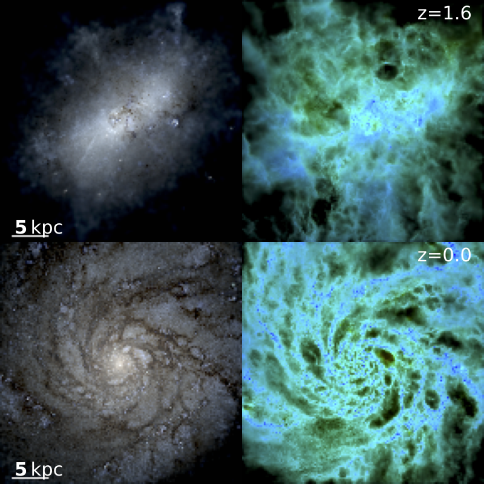

# FIRE_studio
Movie Making Utilities for FIRE simulations

This git repository was lovingly made, the code it contains is largely based off two separate (but related) visualization codes built by Volker Springel and Phil Hopkins. This is not the greatest song in the world, this is just a tribute.

requirements:
[abg_python](https://www.github.com/agurvich/abg_python)



## Installation
To install (with ssh) clone the repository and its dependency
```bash
git clone git@github.com:agurvich/abg_python.git
git clone git@github.com:agurvich/FIRE_studio.git
```
and add them into your python path. I like to install these things to a single folder located at `${HOME}/python` that I add to my python path by including 
```bash
export PYTHONPATH="${HOME}/python:${PYTHONPATH}"
```
in my `.bashrc` file.

Then, if you'd rather install the repositories in a separate folder, you can use a soft link like so:
```bash
ln -s /path/to/repository ${HOME}/python/repository_name
```
So that you don't have to make your `PYTHONPATH` environment variable very confusing. 

You may have to recompile the C binaries, but usually not (I think). I'll update this with instructions for how to do that at a future date. 

## Using FIRE_studio
There are two ways to use FIRE_studio
1) From the command line
2) From a Python script / Jupyter notebook

Each has its benefits/uses. If you run from within an existing Python context you can avoid having to open and reorient a snapshot (assuming you've already done that) by passing a dictionary with the required arrays. 
If you run from the command line I have included a simple multiprocessing ability so that you can render a large number of snapshots simultaneously. 


### Running from the command line
A render-loop can also be started by passing any of the keyword arguments listed below as command line arguments with the addition of `snapstart` and `snapmax`, which are the initial and final snapshots that will be rendered. 
There is also the `mps` flag that determines how many multiprocessing threads should be launched if you'd like to render the snapshots in parallel (1 thread / snapshot), make sure you have enough cores/memory for however many threads you request. 

For a gas density rendering:
`python firestudio/gas_movie_maker.py --snapdir="/home/abg6257/projects/snaps/m12i_res7100/output" --snapstart=555 --snapmax=600 --frame_width=30 --frame_depth=15 --edgeon=1 --datadir="/home/abg6257/src/FIRE_studio" --multiproc=4 --extract_galaxy=1 --noaxis=1`

or for a mock hubble (or SDSS) rendering:
`python firestudio/star_movie_maker.py --snapdir="/home/abg6257/projects/snaps/m12i_res7100/output" --snapstart=555 --snapmax=600 --frame_width=30 --frame_depth=15 --edgeon=1 --datadir="/home/abg6257/src/FIRE_studio" --multiproc=4 --extract_galaxy=1 --noaxis=1`

### Specifying the sort of image you'd like to make  
#### `gas_studio.render` 
##### controlling two-color vs. single color
`image_names` is supposed to control this but it seems to do very little.
passing a string name will plot an image with that name and save it with that name. 
if that name is 

### Running from within a Python context
Begin by importing the studio class you would like to use, `GasStudio` for making volume renderings of the gas and its properties or `StarStudio` for mock Hubble (or SDSS) images using simulated starlight that is attenuated by dense gas (dust lanes for days!).

```python
from firestudio.studios.gas_studio import GasStudio

image_names = [
    'columnDensityMap',
    'massWeightedTemperatureMap',
    'two_color']

gasStudio = GasStudio(
    snapdir,snapnum,
    datadir=datadir,
    frame_half_width=radius,
    extract_galaxy=False, ## already extracted the galaxy
    snapdict=gas_snapdict,
    savefig=savefig,noaxis=noaxis)
        
gasStudio.render(ax,image_names)
```

```python
from firestudio.studios.star_studio import StarStudio

image_names = ['out_u','out_g','out_r','hubble']

starStudio = StarStudio(
    snapdir,snapnum,
    datadir=datadir,
    frame_half_width=radius,
    extract_galaxy=False, ## already extracted the galaxy
    snapdict=gas_snapdict,
    star_snapdict=star_snapdict,
    savefig=savefig,noaxis=noaxis)
    
starStudio.render(ax,image_names)
```

Where `gas_snapdict` is a python dictionary holding the snapshot arrays for `PartType0` with keys that match the FIRE defaults, `abg_python.snap_utils.openSnapshot` will do this for you. 


## Keyword arguments and their explanation 


### `Studio` kwargs
---
#### paths and which snapshot to open
* `snapdir`,`snapnum` - snapshot directory and snapshot number
* `datadir` - directory to put intermediate and output files
* `overwrite = False` - flag to overwrite intermediate flags
* `h5prefix=''` - string to prepend to projection file
* `this_setup_id = None` - string identifier in the intermediate projection file
* `intermediate_file_name = "proj_maps"` - the name of the file to save maps to
* `savefig = True` - save the image as a png
* `extract_galaxy = False` - uses halo center to extract region around main halo
* `ahf_path = None` - path relative to snapdir where the halo files are stored

#### frame setup
* `frame_half_width`, half-width of image in x direction
* `frame_depth`, z-depth of image (thickness is 2 * frame_depth)
* `frame_center = np.zeros(3)`, center of frame in data space
* `theta=0`,`phi=0`,`psi=0`, euler rotation angles

#### image parameters
* `aspect_ratio = 1` - shape of image, y/x, multiplies frame_half_width for y dimension
* `pixels = 1200` - pixels in x direction

#### image annotation
* `fontsize = 12` - font size of scale bar and figure label
* `figure_label = ''` - string to be put in upper right corner
* `scale_bar = True` - flag to plot length scale bar in lower left corner
* `noaxis = True` - turns off axis ticks

### `GasStudio` kwargs
---
#### required positional arguments passed to `Studio`
* `snapdir`,`snapnum` - snapshot directory and snapshot number
* `datadir` - directory to put intermediate and output files
* `frame_half_width` - half-width of image in x direction
* `frame_depth` - z-depth of image (thickness is 2 * frame_depth)
#### color scale controls
* `min_den=-0.4` - the minimum of the density color/saturation scale (in log(n/n_units))
* `max_den=1.6` - the maximum of the density color/saturation scale (in log(n/n_units))
* `min_quantity=2` - the minimum of the quantity color scale
* `max_quantity=7` - the maximum of the quantity color scale (in log(Q/Q_units))
* `cmap='viridis'` - what colormap to use
#### quantity control
* `single_image = None` - string to determine what sort of 1-color image to make
* `quantity_name='Temperature'` - quantity to make a mass weighted map/2 color image
* `take_log_of_quantity=True` - take log of mass weighted quantity map?
* `use_colorbar = False` - flag to put a colorbar
#### preopened data control
* `use_hsml = True` - flag to use the provided smoothing lengths (if in the snapdict has `SmoothingLength`)
* `snapdict = None` - provide an open snapshot dictionary to save time opening

### `StarStudio` kwargs
---
#### required Positional Arguments
* `snapdir`,`snapnum` - snapshot directory and snapshot number
* `datadir` - directory to put intermediate and output files
* `frame_half_width` - half-width of image in x direction
* `frame_depth` - z-depth of image (thickness is 2 * frame_depth)
#### color scale controls
* `maxden = 1.0e-2` - controls the saturation of the image in a non-obvious way
* `dynrange = 100.0` - controls the saturation of the image in a non-obvious way
* `color_scheme_nasa = True` - flag to use nasa colors (vs. SDSS if false)
#### preopened data control
* `star_snapdict = None` - provide an open snapshot dictionary to save time opening
* `snapdict = None` - provide an open snapshot dictionary to save time opening
